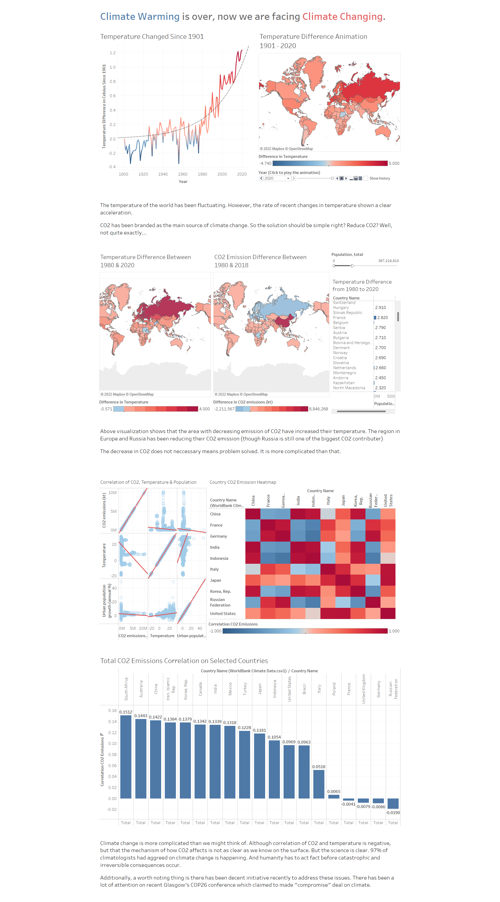

# Untold-Climate-Change-Story

An untold climate change story - a Data Visualization assignment

## 📚Datasets

Climate Change Data by *World Bank*. https://data.worldbank.org/topic/19

Temperature Data by *World Bank*, *Climate Change Knowledge Portal*. https://climateknowledgeportal.worldbank.org/download-data

Environment Data by *UN Data*. http://data.un.org/

## 📊Visualization

Check out our [Tableau visualization](tableau_viz.pdf).

 
    
Full screenshot

    

